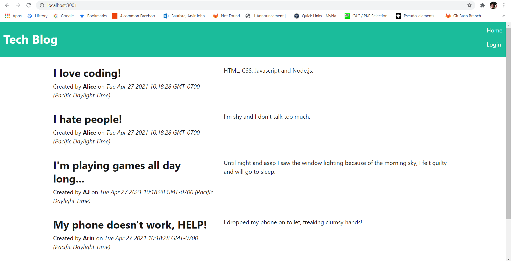
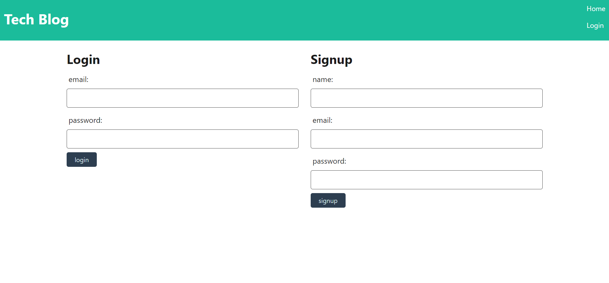
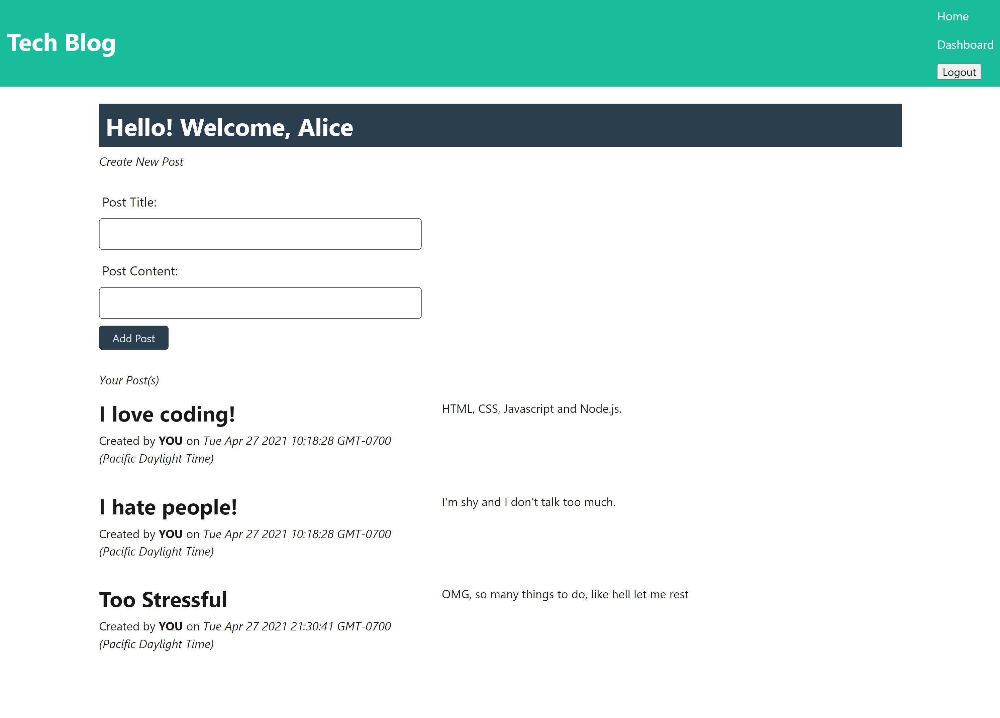

# 14 Model-View-Controller (MVC): Tech Blog

## Description

This web application can be used where developers can publish their blog posts and comment on other developers’ posts as well. It acts as blog site similar to a Wordpress site, it will be deployed in Heroku. It will follow the MVC paradigm in its architectural structure, using Handlebars.js as the templating language, Sequelize as the ORM, and the express-session npm package for authentication.

This application is using the following dependencies:

- dotenv
- sequelize
- bcrypt
- connect-session-sequelize
- express
- express-handlebars
- express-session
- mysql2
- eslint
- prettier

## Screenshots

All account users' posts will be displayed in home.

If you don't have an account yet, fill up in the right side (Signup)
Else if you already have one, fill the form to the left side (Login)

Upon logging in, you will see a form to create new post then under it, all of your posts

## Deployed

URL Live deployed @
https://aj-tech-blog.herokuapp.com/
